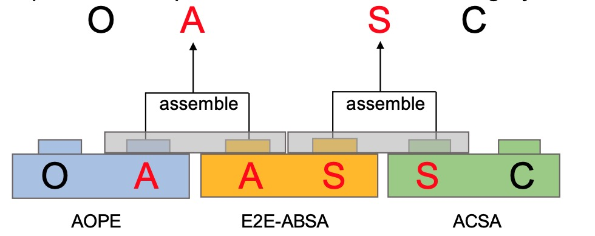
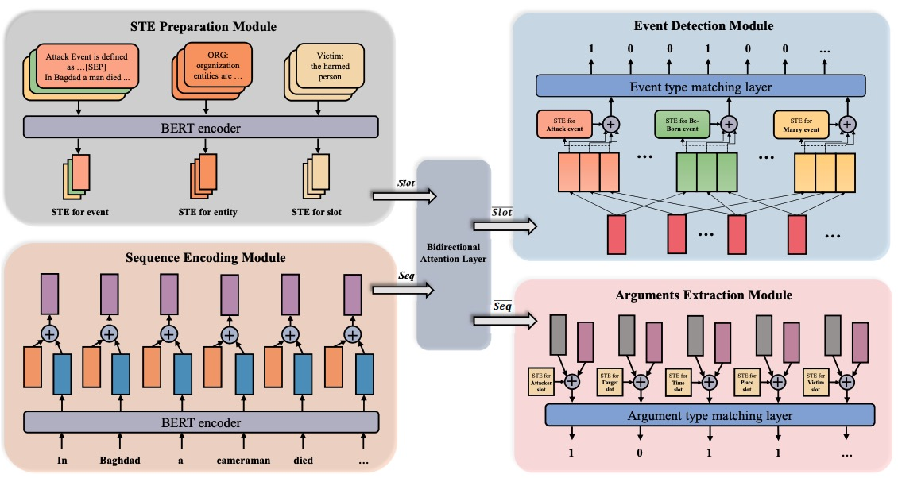

<!-- 
Text can be **bold**, _italic_, or ~~strikethrough~~.

[Link to another page](./another-page.html).

There should be whitespace between paragraphs.

There should be whitespace between paragraphs. We recommend including a README, or a file with information about your project.

### Definition lists can be used with HTML syntax.

<dl>
<dt>Name</dt>
<dd>Tianhao Gao</dd>
</dl>

```
Long, single-line code blocks should not wrap. They should horizontally scroll if they are too long. This line should be long enough to demonstrate this.
```

```
The final element.
```

# Education

This is a normal paragraph following a header. GitHub is a code hosting platform for version control and collaboration. It lets you and others work together on projects from anywhere.

# Papers
  ## Conference
> This is a blockquote following a header.
>
> When something is important enough, you do it even if the odds are not in your favor.
  ## preprint
# Experience

```js
// Javascript code with syntax highlighting.
var fun = function lang(l) {
  dateformat.i18n = require('./lang/' + l)
  return true;
}
```

```ruby
# Ruby code with syntax highlighting
GitHubPages::Dependencies.gems.each do |gem, version|
  s.add_dependency(gem, "= #{version}")
end
```

#### Header 4

*   This is an unordered list following a header.
*   This is an unordered list following a header.
*   This is an unordered list following a header.

##### Header 5

1.  This is an ordered list following a header.
2.  This is an ordered list following a header.
3.  This is an ordered list following a header.

###### Header 6

| head1        | head two          | three |
|:-------------|:------------------|:------|
| ok           | good swedish fish | nice  |
| out of stock | good and plenty   | nice  |
| ok           | good `oreos`      | hmm   |
| ok           | good `zoute` drop | yumm  |

### There's a horizontal rule below this.

* * *

### Here is an unordered list:

*   Item foo
*   Item bar
*   Item baz
*   Item zip

### And an ordered list:

1.  Item one
1.  Item two
1.  Item three
1.  Item four

### And a nested list:

- level 1 item
  - level 2 item
  - level 2 item
    - level 3 item
    - level 3 item
- level 1 item
  - level 2 item
  - level 2 item
  - level 2 item
- level 1 item
  - level 2 item
  - level 2 item
- level 1 item

### Small image


### Large image


 -->
## Education

- Ph.D. still seeking
- M.S. in Computer Technoloy, Peking University, 2019-2022
- B.S. in Software  Engineering, Wuhan University of Technology, 2015-2019

## Publications
### Conference Papers


<!--  -->

- Tianhao Gao, Jun Fang, Hanyu Liu, et al. (2022.) “LEGO-ABSA: A Prompt-based Task Assemblable Unified Generative Framework for Multi-task Aspect-based Sentiment Analysis.” In Proceedings of the 29th International Conference on Computational Linguistics, pages 7002–7012, [Link](https://aclanthology.org/2022.coling-1.610.pdf)[Slide](https://docs.google.com/presentation/d/1P9n2fXcbiXS980pE7TAIdcb5upj82d1t/edit?usp=sharing&ouid=111174972996846420319&rtpof=true&sd=true)
### Prerints
<!--  -->


- Haochen Li, Tianhao Gao* ,Weiping Li, et al. (2020) “Joint Event Extraction via Structural Semantic Matching,” preprint [Link](https://arxiv.org/abs/2306.03469)


## Projects

### Project 1: Multi-modal Tagging System
![[Octocat]](figure/multimodal-loss.jpg)


- Selected the optimal base model and architecture through a thorough comparison and evaluation of different alternatives.
- Constructed high-quality training data using PySpark and Hive SQL techniques.
- Trained a multi-modal tagging model and devoloped a recursive algorithm to determine the appropriate threshold, achieving an impressive 90% accuracy

### Project 2: Vertical domain Large-scale Language Model 

- Conducted extensive research on open-source training methodologies, including parameter efficient training (PEFT), full fine-tuning
(FT), and RLHF training.
- Collected a diverse range of open-source training datasets and explored data creation techniques.
- Investigated various base models and compared their features.
- Trained domain-specific LLMs using diffe

### project 3: Counterfeit Brand Titles Detection System
- Performed a comprehensive problem analysis and proposed a modular system architecture to decouple and solve various challenges.
- Employed traditional algorithms, including edit distance, minimum window substring, and recursive algorithm combined with the
CV2 library to calculate 

## Contact Information

- Email: gaotianhao@pku.edu.cn
