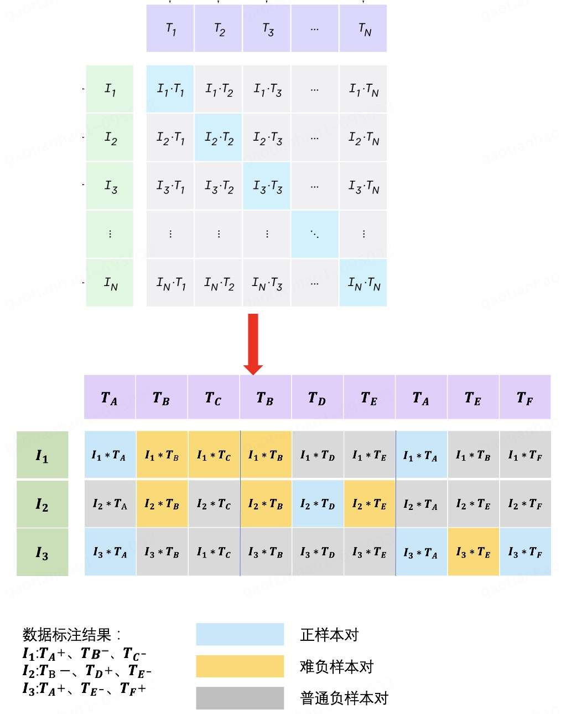

  

    
  

  

    <h2>Tianhao Gao</h2>
    <ul class="experience">
      <li><strong>Algorithm Engineer</strong>, JD.com, 2022-now</li>
      <li><strong>M.S. in Computer Technology</strong>, Peking University, 2019-2022</li>
      <li><strong>B.S. in Software Engineering</strong>, Wuhan University of Technology, 2015-2019</li>
    </ul>
    
Email: gaotianhao@pku.edu.cn

  

## Publications
### Conference Papers
<!--  -->
- Tianhao Gao, Jun Fang, Hanyu Liu, et al. (2022.) “LEGO-ABSA: A Prompt-based Task Assemblable Unified Generative Framework for Multi-task Aspect-based Sentiment Analysis.” In Proceedings of the 29th International Conference on Computational Linguistics, pages 7002–7012, [Link](https://aclanthology.org/2022.coling-1.610.pdf) ｜ [Slide](https://docs.google.com/presentation/d/1P9n2fXcbiXS980pE7TAIdcb5upj82d1t/edit?usp=sharing&ouid=111174972996846420319&rtpof=true&sd=true)

[Introduce Page of LEGO-ABSA](pages/LEGO-ABSA.md).

- Tianhao Gao, Jun Fang, et al. (2025.) “Soft Prompts, Strong Alignment: Aligning LLMs with Fine-Grained Instruction-Following Embeddings” Nips在投, [Link](https://aclanthology.org/2022.coling-1.610.pdf)

[Introduce Page of InstEmb](pages/InstEmb.md).

- Jiaoyang Li, Jun Fang, Tianhao Gao, et al. (2025.) “FANoise: Feature-Adaptive Noise Driven Representation Learning.” aaai在投, [Link](https://aclanthology.org/2022.coling-1.610.pdf)

[Introduce Page of FANoise](pages/LEGO-ABSA.md).

### Preprint

- Haochen Li, Tianhao Gao* ,Weiping Li, et al. (2020) “Joint Event Extraction via Structural Semantic Matching,” preprint [Link](https://arxiv.org/abs/2306.03469)

[Introduce Page of JSSM](pages/STE.md).

## Patents

<!-- - Tianhao Gao, et al. "Aspect-based sentiment analysis method based on text style transfer” Submitted

[Introduce Page](pages/patent1.md). -->

- Tianhao Gao, et al. "An Iterative Training Framework and Hierarchical Contrastive Loss for Graph-Text Matching" Submitted

<!-- [Introduce Page](pages/patent2.md). -->

- https://www.patentguru.com/cn/search?q=CN115759292A 《模型的训练方法及装置、语义识别方法及装置、电子设备》

## Projects

### Project 1: 多模态商品内容标签打标系统

- Selected the optimal base model and architecture through a thorough comparison and evaluation of different alternatives.
- Constructed high-quality training data using PySpark and Hive SQL techniques.
- Trained a multi-modal tagging model and devoloped a recursive algorithm to determine the appropriate threshold, achieving an impressive 90% accuracy

### Project 2: 京东前台类目识别模型

### Project 3: 

### project 4: Counterfeit Brand Titles Detection System
- Performed a comprehensive problem analysis and proposed a modular system architecture to decouple and solve various challenges.
- Employed traditional algorithms, including edit distance, minimum window substring, and recursive algorithm combined with the CV2 library to calculate 

## Contact Information

- Email: gaotianhao@pku.edu.cn
