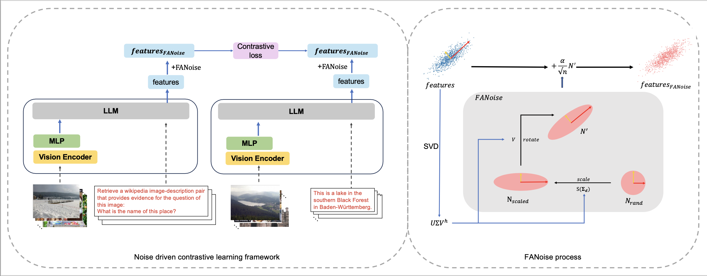

  

    
  

  

    <h2>Tianhao Gao</h2>
    <ul class="experience">
      <li><strong>Algorithm Engineer</strong>, JD.com, 2022-now</li>
      <li><strong>M.S. in Computer Technology</strong>, Peking University, 2019-2022</li>
      <li><strong>B.S. in Software Engineering</strong>, Wuhan University of Technology, 2015-2019</li>
    </ul>
    
Email: gaotianhao@pku.edu.cn

  

## Publications

### 📚 Conference Papers

#### 1. LEGO-ABSA: A Prompt-based Task Assemblable Unified Generative Framework for Multi-task Aspect-based Sentiment Analysis  
**Tianhao Gao**, Jun Fang, Hanyu Liu, et al. *(COLING 2022)*  
[📄 Paper](https://aclanthology.org/2022.coling-1.610.pdf) | [📽️ Slides](https://docs.google.com/presentation/d/1P9n2fXcbiXS980pE7TAIdcb5upj82d1t/edit?usp=sharing&ouid=111174972996846420319&rtpof=true&sd=true) | [📝 Introduction](pages/LEGO-ABSA.md)  

---

#### 2. Soft Prompts, Strong Alignment: Aligning LLMs with Fine-Grained Instruction-Following Embeddings  
**Tianhao Gao**, Jun Fang, et al. *(NeurIPS 2025, Under Review)*  
[📄 Paper (Preprint)](https://aclanthology.org/2022.coling-1.610.pdf) | [📝 Introduction](pages/InstEmb.md)  

---

#### 3. FANoise: Feature-Adaptive Noise Driven Representation Learning  
Jiaoyang Li, Jun Fang, **Tianhao Gao**, et al. *(AAAI 2025, Under Review)*  
[📄 Paper (Preprint)](https://aclanthology.org/2022.coling-1.610.pdf) | [📝 Introduction](pages/FANoise.md)  

---

### 📑 Preprints

#### Joint Event Extraction via Structural Semantic Matching  
Haochen Li, **Tianhao Gao***, Weiping Li, et al. *(Preprint, 2020)*  
[📄 arXiv](https://arxiv.org/abs/2306.03469) | [📝 Introduction](pages/STE.md)  

## Patents

<!-- - Tianhao Gao, et al. "Aspect-based sentiment analysis method based on text style transfer” Submitted

[Introduce Page](pages/patent1.md). -->

- Tianhao Gao, et al. "An Iterative Training Framework and Hierarchical Contrastive Loss for Graph-Text Matching" Submitted

<!-- [Introduce Page](pages/patent2.md). -->

- https://www.patentguru.com/cn/search?q=CN115759292A 《模型的训练方法及装置、语义识别方法及装置、电子设备》

## Projects

### Project 1: 多模态商品内容标签打标系统

- Selected the optimal base model and architecture through a thorough comparison and evaluation of different alternatives.
- Constructed high-quality training data using PySpark and Hive SQL techniques.
- Trained a multi-modal tagging model and devoloped a recursive algorithm to determine the appropriate threshold, achieving an impressive 90% accuracy

### Project 2: 京东前台类目识别模型
- 内衣类目完成Qwen2.5-7b模型SFT，业务验收准确率90.5%。完成内衣类目全量数据刷数，沉淀1.2亿数据资产, AB实验初步结果体验得分绝对提升0.25分，符合业务预期。
- 前台类目识别完成模型迭代方案升级，升级后的方案不依赖人工数据标注，可自动化进行难例挖掘。
- 服饰一级类目产品词挖掘挖出，基于180天全量搜索query，产出约1万产品词。

### Project 3.1: 京东商详页问答RAG模型
- 基于GPT4完成商详问答SFT数据集构建，并且建立测试数据集。
- 构建问答增强的Bloom模型，并基于Langchain构建问答全流程，算法自测准确率88% ，完成三个一级类目服务部署上线。
- 调研RAG领域主流做法。利用商详问答LLM模型生产监督数据，反向优化向量检索模型，将向量检索模型的top1准确率由0.7624提升至0.7729，提升1.1个百分点，将bge-small模型的能力提升至stella-large的水平。

### Project 3.2: apple自营店客服RAG
- RAG模块，采用glm3，自测准确率85%+。全流程UAT测试，只考虑严格正确的正确率是81.1%，加上不是最佳部分正确率为89.5%。服务已上线，业务AB中。
- RAG模块，baseline模型升级，完成qwen1.5系列和qwen2系列模型在apple的训练和效果验证，迭代上线推进中。
- 基于LLM+客服对话，构建信息抽取pipeline，完成客服有效对话抽取能力建设，并在apple watch品类上完成测试。基于该能力可以生产的数据包括 a) 客服有效对话数据 b) 问答数据对，可用于编码模型训练 c) 商品信息结构化图谱
- 构建Mac品类训练数据的构造，完成Apple问答模型增量训练，通过回归测试。Mac品类上线，准确率85%+达成目标

### project 4: 商品理解大模型
- 商品理解大模型准确率达成90%+
- 沉淀数据资产新增总量11.5亿，其中前台类目5.7亿，商品数据资产1.2亿，规格属性抽取3.8亿，品类知识图谱0.4亿，商品短标题0.4亿
- 沉淀数据资产存储量新增超过1TB

### project 5: 标签联想能力建设

### project 5: Counterfeit Brand Titles Detection System
- Performed a comprehensive problem analysis and proposed a modular system architecture to decouple and solve various challenges.
- Employed traditional algorithms, including edit distance, minimum window substring, and recursive algorithm combined with the CV2 library to calculate 
