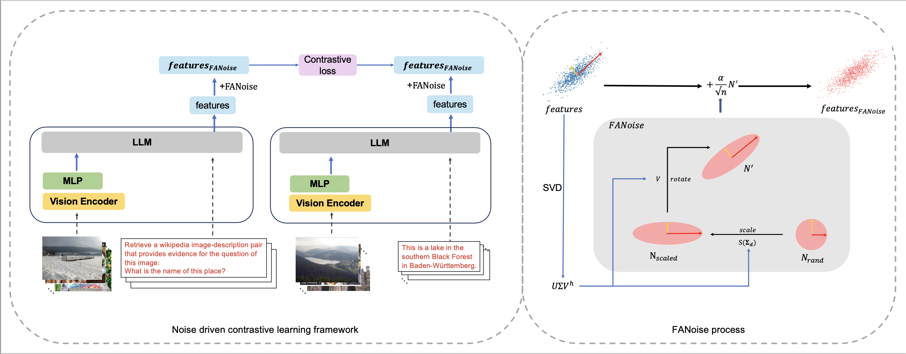
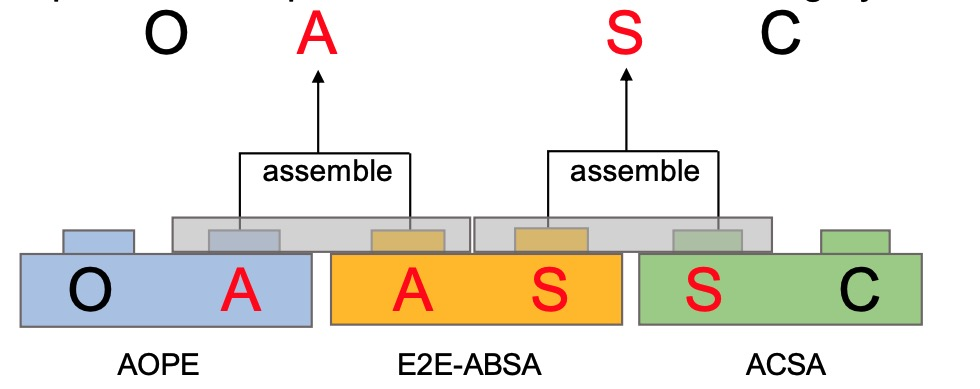
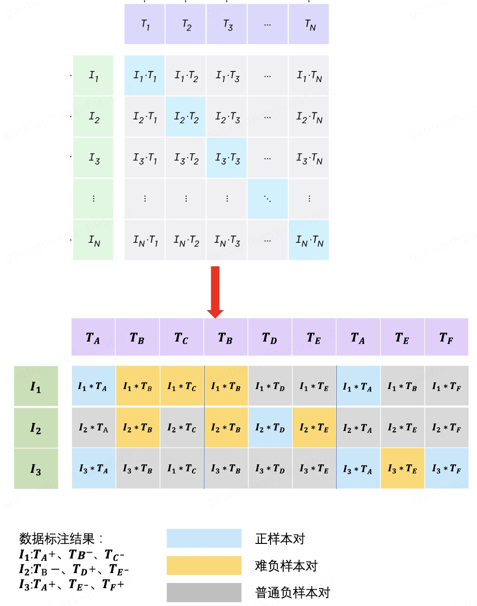

<section class="profile-container" id="about">
  

    
  

  

    
Personal Homepage

    <h1>Tianhao Gao</h1>
    

      I am an algorithm engineer at JD.com, where I build JD's AI Product Graph and item-understanding systems.
      My work focuses on large-scale LLM/VLM training and inference, reinforcement learning methods,
      representation learning, retrieval, and industrial NLP systems for e-commerce.
    

    <ul class="profile-meta">
      <li><strong>Algorithm Engineer</strong>, JD.com, 2022-Present</li>
      <li><strong>M.S. in Computer Technology</strong>, Peking University, 2019-2022</li>
      <li><strong>B.S. in Software Engineering</strong>, Wuhan University of Technology, 2015-2019</li>
    </ul>
    

      <a href="mailto:gaotianhao@pku.edu.cn">gaotianhao@pku.edu.cn</a>
      |
      <a href="https://github.com/scarydemon2">GitHub</a>
      |
      <a href="https://scholar.google.com/citations?user=GpVmQ7EAAAAJ&hl=en">Google Scholar</a>
    

  

</section>

<section id="news" markdown="1">

## News

- **2026.06** - Completed [**JD Oxygen AI Item Center (Oxygen AIIC) V1**](#projects), an industrial-scale LLM/VLM-centric solution for item understanding, management, and applications.
- **2026.07** - [*InstEmb*](https://icml.cc/virtual/2026/poster/62511) accepted to ICML 2026 as a poster.
- **2026.02** - [*FANoise*](https://ojs.aaai.org/index.php/AAAI/article/view/37545) accepted to AAAI 2026.
- **2022.10** - [*LEGO-ABSA*](https://aclanthology.org/2022.coling-1.610/) accepted to COLING 2022.

</section>

<section id="publications" markdown="1">

## Publications

### Conference Papers

  
ICML 2026

  <h3>InstEmb: Instruction-Following Embeddings through Glimpses of the Future</h3>
  
<strong>Tianhao Gao</strong>, Jun Fang, Xiaohui Zhang, Zhiyuan Liu, Chao Liu, Pengzhang Liu, Qixia Jiang

  
Instruction-following embeddings with output-aware semantic signals and dual-anchor pooling.

  

    <a href="https://icml.cc/virtual/2026/poster/62511">ICML Page</a>
    <a href="pages/InstEmb.html">Project Page</a>
  

  

  
AAAI 2026

  <h3>FANoise: Feature-Adaptive Noise Driven Representation Learning</h3>
  
Jiaoyang Li, Jun Fang, <strong>Tianhao Gao</strong>, et al.

  
Feature-adaptive noise for robust representation learning.

  

    <a href="https://ojs.aaai.org/index.php/AAAI/article/view/37545">Paper</a>
  

  

  
COLING 2022

  <h3>LEGO-ABSA: A Prompt-based Task Assemblable Unified Generative Framework for Multi-task Aspect-based Sentiment Analysis</h3>
  
<strong>Tianhao Gao</strong>, Jun Fang, Hanyu Liu, et al.

  
A unified prompt-based generative framework for multiple aspect-based sentiment analysis tasks.

  

    <a href="https://aclanthology.org/2022.coling-1.610.pdf">Paper</a>
    <a href="https://docs.google.com/presentation/d/1P9n2fXcbiXS980pE7TAIdcb5upj82d1t/edit?usp=sharing&ouid=111174972996846420319&rtpof=true&sd=true">Slides</a>
  

  

### Preprints

  <h3>Joint Event Extraction via Structural Semantic Matching</h3>
  
Haochen Li, <strong>Tianhao Gao*</strong>, Weiping Li, et al. (* equal contribution)

  

    <a href="https://arxiv.org/abs/2306.03469">arXiv</a>
  

</section>

<section id="projects" markdown="1">

## Selected Projects

  <article class="project-card">
    <h3>JD Oxygen AI Item Center (Oxygen AIIC) / Large Product Understanding Model</h3>
    
Built and iterated a large-scale LLM/VLM-centric item-understanding platform centered on JD's AI Product Graph.

    <ul>
      <li>Delivered Oxygen AIIC V1 for item understanding, management, and downstream applications.</li>
      <li>Reached <strong>90%+</strong> accuracy in product-understanding tasks through continuous model and data iteration.</li>
      <li>Accumulated large-scale data assets across taxonomy, attributes, knowledge graphs, and titles, adding over <strong>1TB</strong> of structured assets.</li>
    </ul>
  </article>

  <article class="project-card">
    <h3>JD Front-end Category Recognition</h3>
    
Upgraded category-recognition models and data assets for large-scale product taxonomy systems.

    <ul>
      <li>Fine-tuned Qwen2.5-7B for apparel category recognition with about <strong>90.5% validation accuracy</strong>.</li>
      <li>Reduced dependence on manual labeling through automatic hard-example mining.</li>
      <li>Mined product terms from large-scale search query logs for downstream taxonomy enrichment.</li>
    </ul>
  </article>

  <article class="project-card">
    <h3>Product Detail Page QA / RAG</h3>
    
Developed retrieval-augmented QA models for product-detail scenarios.

    <ul>
      <li>Constructed SFT and evaluation data with GPT-assisted pipelines.</li>
      <li>Built a LangChain-based QA flow and deployed it for multiple first-level categories.</li>
      <li>Improved vector retrieval top-1 accuracy from <strong>76.24%</strong> to <strong>77.29%</strong>.</li>
    </ul>
  </article>

  <article class="project-card">
    <h3>Apple Store Customer-Service RAG</h3>
    
Built and evaluated RAG components for Apple self-operated store customer-service scenarios.

    <ul>
      <li>Reached <strong>85%+</strong> offline accuracy and <strong>89.5%</strong> including partially correct UAT answers.</li>
      <li>Validated Qwen-series baselines and prepared incremental model upgrades.</li>
      <li>Designed an LLM-based information-extraction pipeline from customer-service conversations.</li>
    </ul>
  </article>

  <article class="project-card">
    <h3>Counterfeit Brand Title Detection</h3>
    
Designed a modular detection system for counterfeit-brand title risks.

    <ul>
      <li>Decoupled detection challenges into explainable modules.</li>
      <li>Combined edit distance, minimum-window matching, recursive algorithms, and CV2-based signals.</li>
    </ul>
  </article>

  <article class="project-card">
    <h3>Multimodal Product Content Tagging</h3>
    
Built a multimodal tagging pipeline for e-commerce product understanding.

    <ul>
      <li>Compared base models and architectures for production constraints.</li>
      <li>Constructed high-quality training data with PySpark and Hive SQL.</li>
      <li>Reached about <strong>90% accuracy</strong> with a recursive thresholding strategy.</li>
    </ul>
    
  </article>

</section>

<section id="patents" markdown="1">

## Patents

- Tianhao Gao, et al. **An Iterative Training Framework and Hierarchical Contrastive Loss for Graph-Text Matching**. Submitted.
- Tianhao Gao, et al. **Model training method and device, semantic recognition method and device, and electronic device**. CN115759292A. [PatentGuru](https://www.patentguru.com/cn/search?q=CN115759292A)

</section>
