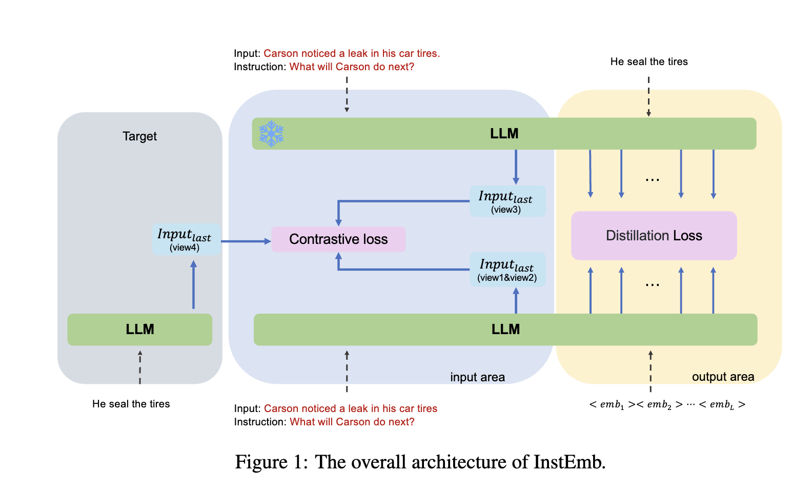

# InstEmb

## Instruction-Aware Embedding introduce

Instruction-Aware Embedding aims to generate text embeddings conditioned on specific instructions, enabling embeddings to capture distinct semantic aspects based on different instructions. Ideally, embeddings generated under diverse instructions should highlight different semantic emphases of the same text, providing richer, more targeted semantic representations.

For example, in product retrieval scenarios, embeddings conditioned on queries such as *"Is this product suitable for outdoor use?"* and *"Does this product have warranty coverage?"* should ideally reflect different semantic aspects of the same product description.

## Abstract

Recent advances have empowered large language models (LLMs) with remarkable fine-grained instruction-following capabilities in text generation tasks. However, embedding methods typically rely solely on the final token’s hidden state, limiting their ability to capture complementary semantic signals across multiple tokens. Moreover, existing discrete-to-continuous re-encoding approaches introduce semantic discontinuity. To address these limitations, we propose **InstEmb**, a novel instruction-aware embedding framework that jointly optimizes primary semantic information (via contrastive learning on the final token) and complementary semantic signals (through representation distillation with learnable soft prompts). Additionally, we introduce **Dual-Anchor Alignment Pooling (DAAP)**, explicitly aligned with our dual training objectives. Extensive experiments demonstrate that InstEmb achieves state-of-the-art performance across multiple instruction-aware benchmarks, significantly outperforming strong baselines such as Inbedder, FollowIR, and Promptriever without benchmark-specific supervised data. Furthermore, InstEmb exhibits robust generalization to generic embedding tasks, despite using substantially fewer training examples. Ablation analyses reveal the effectiveness of our proposed distillation and contrastive strategies, highlighting the critical regularization role of soft prompts.

## Motivation

Recently, large language models (LLMs) have significantly advanced in their ability to follow fine-grained instructions, achieving impressive zero-shot performance across diverse downstream tasks. However, fine-grained instruction adaptability remains challenging for LLM-based embedding methods. Existing embedding methods suffer from several limitations:

- Typically rely solely on the final token’s hidden state as embeddings, fundamentally constraining the model’s capacity to capture complementary semantic signals distributed across multiple critical tokens.

- Existing discrete-to-continuous re-encoding approaches introduce semantic discontinuity, creating a semantic reconstruction gap, where sampling during decoding disrupts latent semantic continuity.

- Lack of explicit mechanisms to jointly optimize primary semantic information (captured by final token) and complementary semantic signals (distributed across tokens).

Thus, there is a clear need for an embedding method that can jointly optimize both primary and complementary semantic information, preserving semantic continuity and ensuring robust instruction adaptability.

## Method

To explicitly optimize both primary semantic information and complementary semantic signals, we propose **InstEmb**, a novel instruction-aware embedding framework. InstEmb employs two main optimization strategies:

- **Representation Distillation**: We append learnable soft prompt tokens to the input sequence, aligning their hidden states with those of a frozen instruction-tuned teacher model. This process transfers complementary semantic signals distributed across multiple critical tokens into the student model.

- **Contrastive Learning**: We apply supervised contrastive learning at the final token position, explicitly enhancing primary semantic alignment. Multiple embedding views (e.g., dropout-based SimCSE, teacher embeddings, and answer embeddings) are leveraged to ensure robust semantic alignment.

Additionally, we propose **Dual-Anchor Alignment Pooling (DAAP)**, explicitly aligned with our dual training objectives. DAAP integrates two semantically complementary anchors:

- **Primary Semantic Anchor**: The hidden state of the final input token, optimized via contrastive learning.

- **Complementary Semantic Anchor**: The average hidden states of soft prompt tokens, optimized via representation distillation.

The overall framework of InstEmb is illustrated below:

## Performance

InstEmb achieves state-of-the-art performance across multiple instruction-aware benchmarks and competitive results in generic embedding tasks, significantly outperforming strong baselines without benchmark-specific supervised training.

The main results are shown below:

## Application in work

InstEmb can be effectively applied to various practical embedding scenarios, such as:

- **Instruction-Aware Retrieval**: Generating embeddings conditioned on specific user queries or instructions, significantly improving retrieval accuracy and interpretability in search engines or product retrieval systems.

- **Semantic Matching and Clustering**: Leveraging instruction-conditioned embeddings to capture diverse semantic aspects of text, enhancing performance in semantic matching, clustering, and recommendation tasks.

- **General Embedding Applications**: Utilizing InstEmb’s robust generalization capabilities to enhance generic embedding tasks, achieving strong performance even with limited training data.

In our work, InstEmb provides an efficient and powerful embedding solution, enabling fine-grained instruction adaptability and significantly improving embedding quality across diverse semantic tasks.

[back](./)