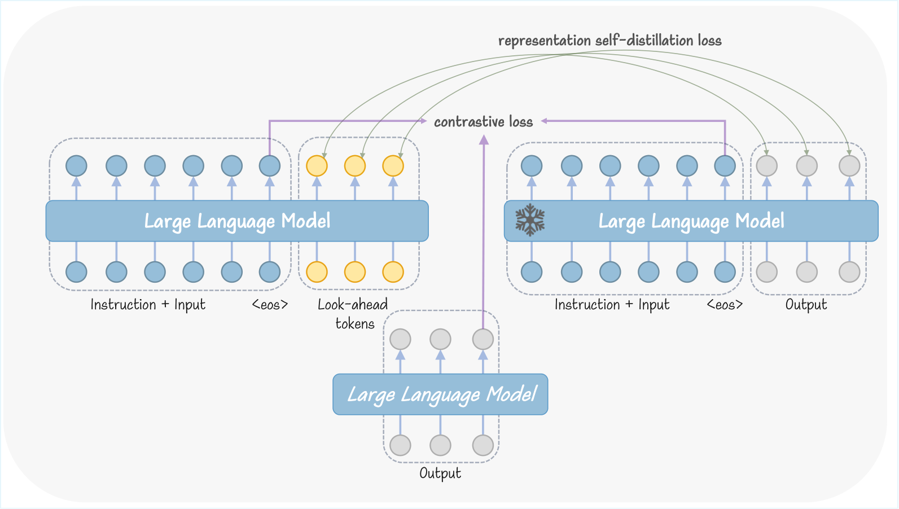
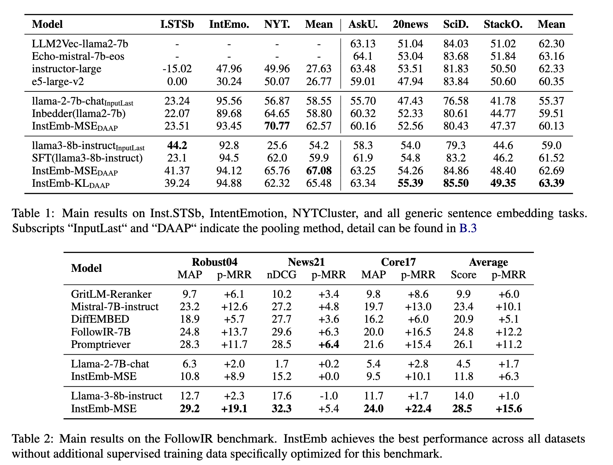

# InstEmb: Instruction-Following Embeddings through Glimpses of the Future

**Tianhao Gao**, Jun Fang, Xiaohui Zhang, Zhiyuan Liu, Chao Liu, Pengzhang Liu, Qixia Jiang 
*Accepted to ICML 2026 as a poster*

[ICML Poster Page](https://icml.cc/virtual/2026/poster/62511) | [Back to homepage]({{ '/' | relative_url }}#publications)

## Overview

Instruction-following embeddings aim to generate text representations conditioned on a specific instruction. The same text can emphasize different semantic aspects depending on the instruction, which is especially useful for retrieval, semantic matching, product understanding, and recommendation systems.

For example, in product retrieval, embeddings conditioned on *"Is this product suitable for outdoor use?"* should focus on different evidence than embeddings conditioned on *"Does this product have warranty coverage?"*.

## Abstract

Recent advances have empowered large language models with strong fine-grained instruction-following capabilities in text generation tasks. However, embedding methods often rely on the hidden state of the input's last token, which limits their ability to capture semantic signals distributed across output tokens. Existing discrete-to-continuous re-encoding approaches can also introduce semantic discontinuity.

InstEmb addresses these limitations by jointly optimizing input-intrinsic semantic information and output-aware semantic information. It uses contrastive learning on the representation of the last input token, representation self-distillation with learnable look-ahead tokens, and Dual-Anchor Alignment Pooling (DAAP) to combine complementary semantic anchors.

## Method

InstEmb contains three main components:

- **Input-intrinsic semantic learning**: supervised contrastive learning focuses on the final input-token representation.
- **Output-aware semantic learning**: learnable look-ahead tokens distill useful future semantic information without extra decoding latency.
- **Dual-Anchor Alignment Pooling (DAAP)**: combines the final-token anchor and the look-ahead-token anchor to form a stronger embedding.

## Results

InstEmb achieves strong performance across instruction-following embedding benchmarks and maintains competitive generalization on generic embedding tasks.

## Practical applications

- **Instruction-aware retrieval**: adapt retrieval representations to user intent.
- **Semantic matching and clustering**: capture multiple semantic views of the same text.
- **Product understanding**: improve retrieval and matching in e-commerce scenarios where query intent is fine-grained.
