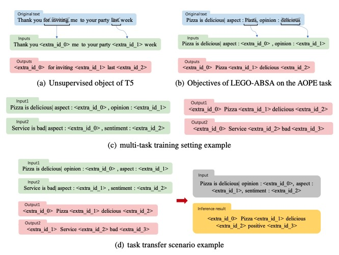
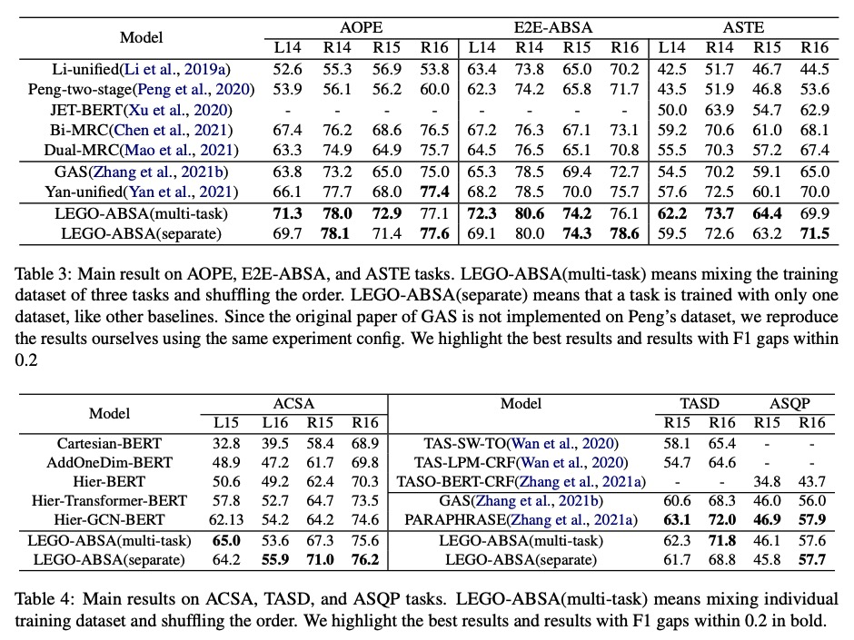

# LEGO-ABSA

## ABSA introduce

ABSA aims to extract different elements including: 1) the aspect term(a); 2) opinion term(o); 3) the aspect category(c) corresponding to the aspect term; 4) the sentiment polarity(s) for a specific aspect term. 

For example, in the sentence *“Pizza is delicious”*, *“Pizza”* is an aspect term belonging to the food category, and the corresponding opinion term is *“delicious”*, which expresses positive sentiment.

Below are the task objectives for all subtasks.

## Abstract

Aspect-based sentiment analysis (ABSA) has received increasing attention recently. ABSA can be divided into multiple tasks according to the different extracted elements. Existing generative methods usually treat the output as a whole string rather than the combination of different elements and only focus on a single task at once. This paper proposes a unified generative multi-task framework that can solve multiple ABSA tasks by controlling the type of task prompts consisting of multiple element prompts. Further, the proposed approach can train on simple tasks and transfer to difficult tasks by assembling task prompts, like assembling Lego bricks. We conduct experiments on six ABSA tasks across multiple benchmarks. Our proposed multi-task approach achieves new state-of-the-art results in almost all tasks and competitive results in task transfer scenarios.

## Motivation

Recently, large-scale generative language models have become increasingly powerful, and any ABSA task can be converted to a generative problem. Many generative methods have been proposed But they:

- Usually only solve one task at a time, and if you want to solve multiple tasks, you need to train a model for each task.

- Another limitation of existing generative methods is that they treat the output as a whole string, without considering the different elements that make up the output. This approach may not be optimal, as different elements may have different meanings and should be treated accordingly. Therefore, there is a need for a more nuanced approach to generative language modeling that takes into account the different elements of the output.

- Finally, existing generative methods often have poor transferability from simple tasks to more complex tasks. This means that a model that performs well on a simple task may not generalize well to more challenging tasks. This limitation undermines the usefulness of generative language models in practical applications, where the ability to transfer knowledge across tasks is critical. Thus, there is a need for more robust and transferable generative methods that can tackle a wide range of ABSA tasks.

## Method

In order to make the framework fully understand the meaning of each element in the output text, instead of treating the output as a simple string, we design an element prompt for each extracted element. We define the element prompt as follow :

- $p_a$ : "aspect : <extra_id_w>"
- $p_c$ : "category : <extra_id_x>"
- $p_o$ : "opinion : <extra_id_y>"
- $p_s$ : "sentiment : <extra_id_z>"

This method has two advantages. On the one hand, the format is consistent with the T5 unsupervised training object, which can help us make better use of the information learned from pre-training. On the other hand, by defining a prompt for a single element, the output is no longer regarded as a whole text string but as a combination of different elements that offer more convenience.

Methods based on element-level prompts, task prompts, and task transfer prompts are shown in the figure below.

## Performance

The main results of LEGO-ABSA is shown below which achieved SoTA performance in almost all sub-tasks.

## Application in work

[back](./)
