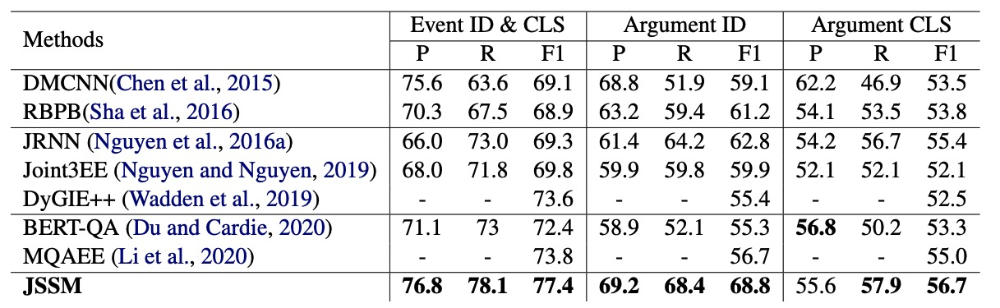

# JSSM

## Event Extraction introduce

EE task aims to extract the event type and its corresponding arguments. For example, given the input text "In Baghdad, a cameraman died when an American tank fired", we can first classify this sentence as an "Attack" event type, and then we should extract the arguments that are related to the event type. In "Attack", the arguments include Attacker, Target, Instrument, Time, and Place. So finally, we extract "Baghdad" as the Place, "cameraman" as the Target, and "tank" as the Instrument.

## Abstract

Event Extraction (EE) is one of the essential tasks in information extraction, which aims to detect event mentions from text (Event Detection subtask) and find the corresponding argument roles. The EE task can be abstracted as a process of matching the semantic definitions and argument structures of event types with the target text. This paper encodes the semantic features of event types and makes structural matching with target text. Specifically, Semantic Type Embedding (STE) and Dynamic Structure Encoder (DSE) modules are proposed. Also, the Joint Structural Semantic Matching (JSSM) model is built to jointly perform event detection and argument extraction tasks through a bidirectional attention layer. The experimental results on the ACE2005 dataset indicate that our model achieves a significant performance improvement.

## Motivation

1. Most works regard Event Detection as a classification task in which the event type is regarded as a one-hot label which cantains no semantic meanings. 
2. A Event which contains its type and corrsponding argument type, so the definition of an event can naturally be viewed as a small knowledge base. However, no one has explored how to model this type of graph structure before (At least before this paper was just completed).
## Method

- Firstly, we use BERT to encode the names of event types such as "Attack," "Marry," and so on. Using this method, we encode the semantic information embedded in the labels. The same method is also used for encoding Argument names. These encodings were called "STE" in our paper.

- Secondly, to construct the knowledge graph structure of event and finish Event Detection subtask, we used an attention mechanism to aggregate information from sentence encoding--> arguments STE-->event STE. Finally, we used the event STE for binary classification.

- Lastly, to complete the argument extraction process, we inverted the attention mechanism to aggregate information from event STE --> argument STE --> sentence encoding. Then, we created a classification head for each argument type to perform binary classification on individual tokens. Tokens with consecutive classifications of 1 were merged into a single argument.
  
## Performance

[back](./)
