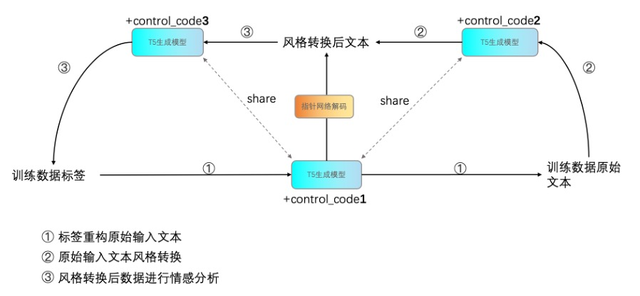

## Motivation

Generative methods often have large errors in generating sentiment polarity. For example, multiple sentiment polarities may coexist in the same sentence. In the model's generated result, the expression of a stronger emotion will mislead the classification results of other emotions.

For instance, in the comment "The sound quality of the speaker is very good, highly recommended, and the included mouse has five sensitivity levels to choose from," both positive and neutral sentiments are present, but the model is likely to classify the sentiment polarity of the mouse's sensitivity as positive.

There are multiple reasons for this phenomenon, including redundant and potentially implicit sentiment in the original input expression.

## Method

If a generative model is used to solve the ABSA problem, the task can be simply modeled as *input->generative model->output*. The information entropy in the output contains the lowest entropy that includes the answer, while the input has the most entropy. It is precisely because of these extra entropies that errors occur. Therefore, if we can transform this task into *input->generative model->input'->output*, where input' is the input after style transfer and its entropy is between the input and output, we can avoid sentiment polarity errors (similar to when performing fine-grained information extraction, if we first summarize and then extract, the task would become easier).

Patent includes three stages:

Stage 1: We use the output from the ABSA dataset as input and generate the input using a generative model. This operation is counterintuitive since the entropy in the output is always lower than that in the input. Therefore, theoretically, the generative model cannot perfectly complete the input. But the model can still try its best to restore the input. After training, we obtain $model_1$, which is only used to generate training data for stage 2.

Stage 2: The output is not visible during inference because the goal is to obtain the output. Therefore, we can use another generative model to train on the input to obtain the input', i.e., input-->generative model 2-->$model_1(output)$. The function of generative model 2 is to distill the high entropy input into low entropy input'. We refer to this model as $model_2$.

Stage 3: During training, I directly use $model_2(input)$-->$model_2$-->output. In this stage, we obtain the final output from input'. We obtain $model_3$.

Inference: $model_2(input)$-->$model_3$-->output.

[back](./)
